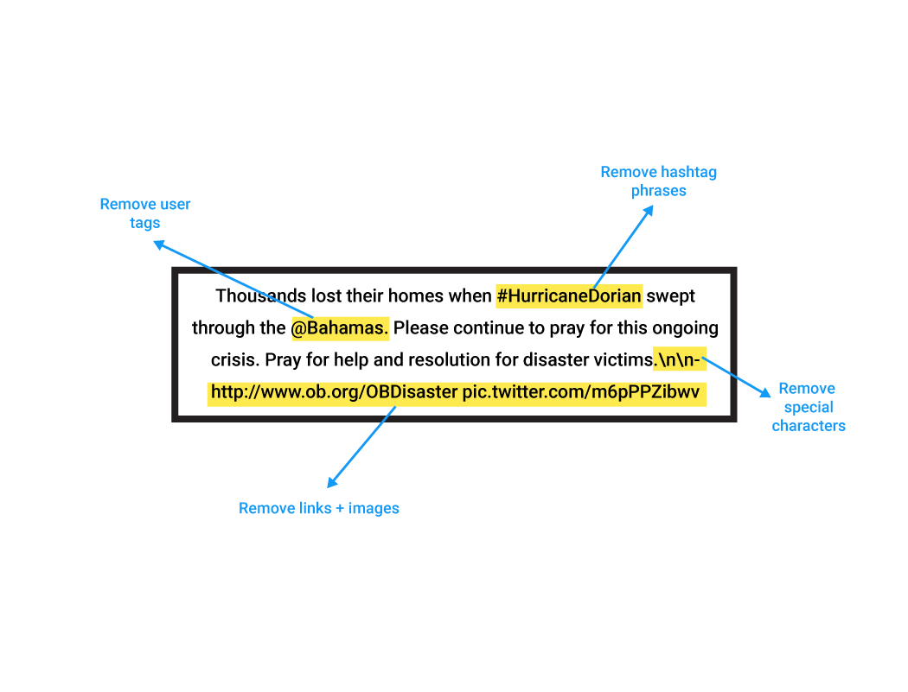
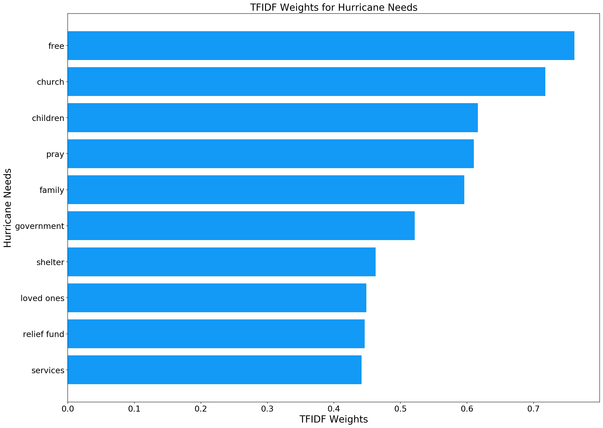
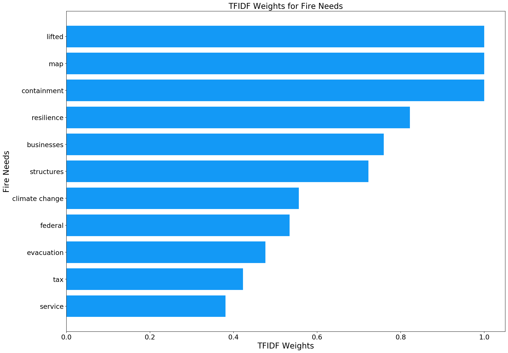
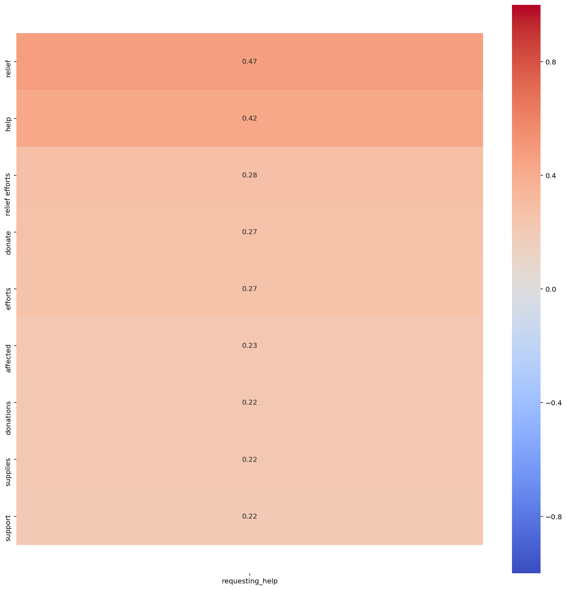
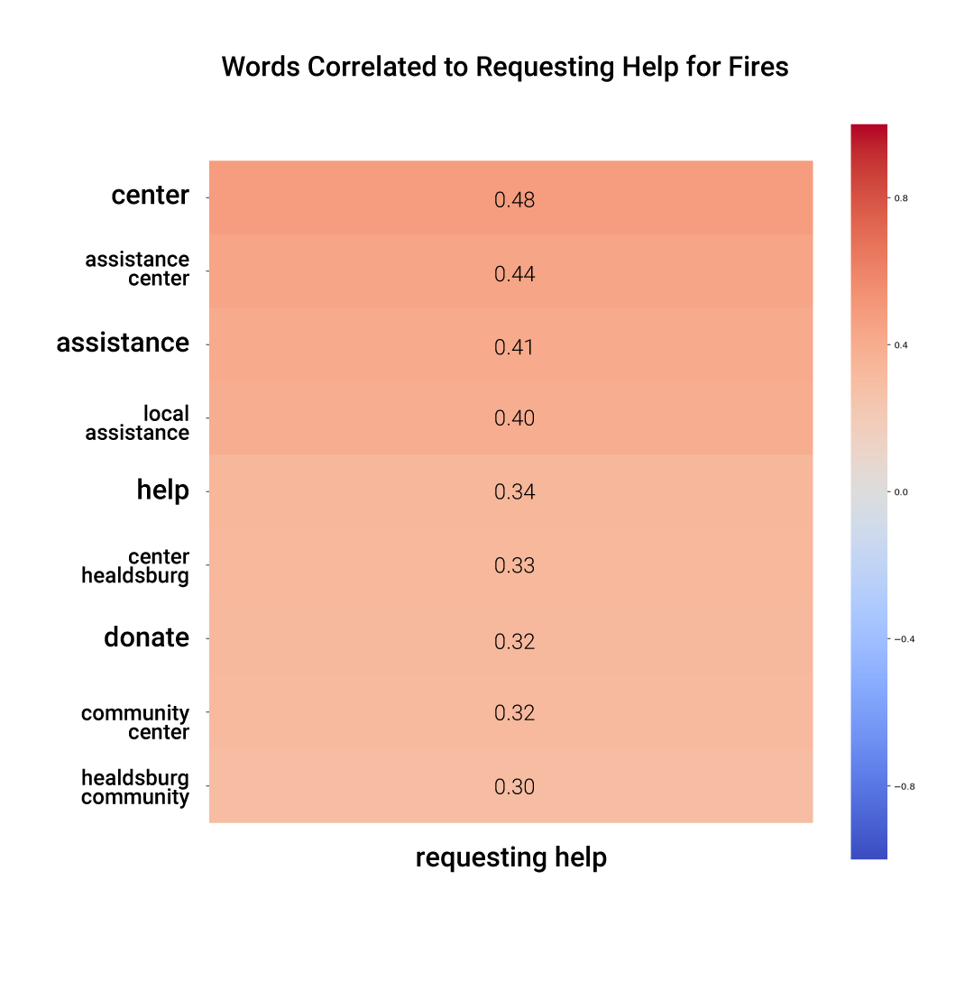
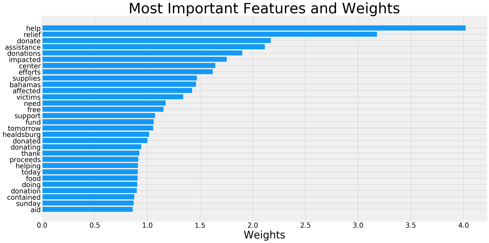
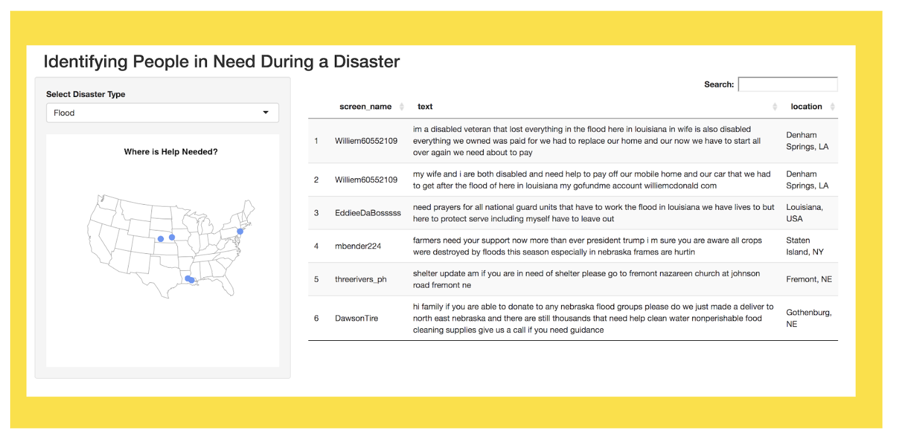

# Identifying People in Need During a Disaster

By [Joshua Kong](https://github.com/joshuakong818), [Brian Tweed](https://github.com/briantweed1), and [Vivian Peng](https://githuhb.com/veeps)

## Executive Summary

In this project, we used natural language processing and classification models to identify whether or not tweet messages during a natural disaster are requesting for help.

---

## Problem Statement

During a natural disaster, it can be challenging to locate where the most urgent needs are. For first responders and organizations providing assistance, it's difficult to locate and triage where help is needed because there isn't a streamlined channel of communication.

__How might we identify people in need during a disaster, based on their tweets?__

---
## Data

For the scope of this pilot, we used Twitter scraper to pull tweets from two types of disasters–hurricanes and fires. For each category, we chose three incidences each and pulled tweets from searching its hashtags. Code for our twitter scrapes can be found here: [Hurricanes](./code/01_data_collection_hurricanes.ipynb) and [Fires](./code/01_fires_data_collection.ipynb)

|Disaster|Hashtag|Dates|
|:---|:---|:---|
|Hurricane Dorian|#hurricanedorian|08-24-2019 to 09-17-2019|
|Hurricane Florence|#hurricaneflorence|08-31-2018 to 09-25-2019|
|Hurricane Maria|#hurricanemaria|09-16-2017 to 10-07-2017|
|Kincade Fire|#kincadefire|10-230-2019 to 11-15-2019|
|Carr Fire|carr fire|07-23-2018 to 09-07-2018|
|Thomas Fire|thomas fire|12-04-2017 to 01-19-2018|

From these Twitter queries, we pulled nearly 80,000 tweets. Cleaning on text data was done [here](./code/002_data_cleaning.ipynb). We used regex to remove hashtags, user tags, links, pictures, and special characters.

---
## EDA

EDA was performed to gain insights on specific needs during hurricanes and fires. The needs after hurricanes were centered around family and God. While the needs during and after fires were more focused on containment, supporting local businesses, and receiving aid from the government.

  
  

In addition to identifying needs, the stronger correlations between words and a tweet being labeled as requesting help were examined. Heatmaps measuring those correlations returned expected results. Words like 'relief', 'donate', and 'assistance center' had strong correlations with tweets being labeled as requesting help.

  
  

---
## Limitations

Limitations in applying model included unhelpful location data from Twitter users, limited training on tweets, not all disaster types being named, internet trolls polluting the pool of disaster tweets, twitter not being the go-to place for requesting help during a disaster, and the potential for internet access being compromised after a natural disaster.

---

## Modeling

We implemented various models, including Logistic Regression, Support Vector Machines ('SVM'), Multinomial Naive Bayes, Gaussian Naive Bayes, and the ensemble model Bagging Classifier which is a decision tree method that utilizes Boostrapping with replacement. Our baseline score was 77%, meaning of the 1,000 tweets that we manually labeled, 77% of the tweets were classified as requesting help. The best model was the SVM utilizing the Count Vectorizer, which had a test score of 91.3%. The SVM has a number of kernels, including Radial Basis Function ('RBF'), linear, polynomial and sigmoid. The RBF kernel, the default, performed much better than the other three. The second best model was a variation of the SVM, however, it used the TFIDF Vectorizer and the default RBF kernel and had a test score of 90.9%. In third place was the Multinomial Naive Bayes model with a 90.1% test score.

The most important features, based on the weights of the coefficients for each word were help, relief, donate, assistance, donations, impacted, center, efforts, supplies, bahamas, affected, victims, need, free, support, fund, tomorrow, Healdsburg, donated, donating, thank, proceeds, helping, today, food, doing, donation, contained, Sunday, and aid.  The top two models had the exact same top words, in the same order. Based on this list, it may be desirable to utilize a lemmatizer or stemmer to shorten words into their stem so that words like donations/donated/donating/donation are combined into one.  This may or may not improve model performance.

In order to test our best performing model, SVM with Count Vectorizer, with data that had not been previously labeled, we ran the built in model prediction function on the remaining 50,000+ tweets. The model predicted 'needs help' for 8,306 of those tweets. The first 150 of these tweets were examined and labeled, and the model correctly predicted needs help for 85% of these tweets.

---
## Dashboard Demo

We envision this model can be useful in real-time disaster relief by:

1. Pull tweets about a disasters
2. Run model to classify tweets in needs
3. Use Twitter API to get user location from the profiles of the tweets that were classified as needing help
4. Use Google maps API to get lattitude/longitude location data
5. First responders can use the dashboard to visualize where help is most needed.

#### [Click to See Demo](https://veeps.shinyapps.io/tweets_disaster_map)

Code for the dashboard can be seen [here](./code/dashboard_code)

---
# Conclusion

The pace of change in social media, like all technology, is increasing rapidly. New platforms, like TikTok, Lasso, Vero, Steemit and Caffeine, are introduced constantly. Likewise, in our ever-changing world, natural and man-made disasters are an ever constant threat. Disaster response and relief must evolve to keep pace with these changes to be as fast and efficient as possible. Drone delivery, autonomous vehicles, machine learning and satellite 5G communications must be leveraged along with these new social media communications tools to minimize the loss of life and property. While privacy of users data is of utmost importance, in the domain of disaster response all data must be leveraged, including location data, to achieve these goals. Since 2012, there has been a Wireless Emergency Alert ('WEA') system in the United States. This system provides geographically targeted alerts during emergency situations. We recommend further study and development of our machine learning algorithm to detect requests for emergency assistance via social media and all other forms of communication. In conjunction with the WEA, our API could greatly enhance disaster preparedness, providing a tool for victims to efficiently and easily communicate their needs during and after an emergency situation, allowing for the most rapid response possible in the delivery of medical assistance and life sustaining supplies.
